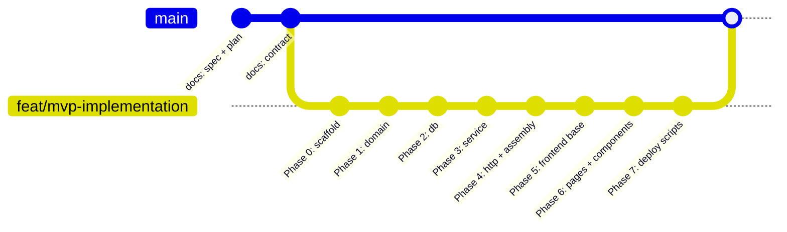
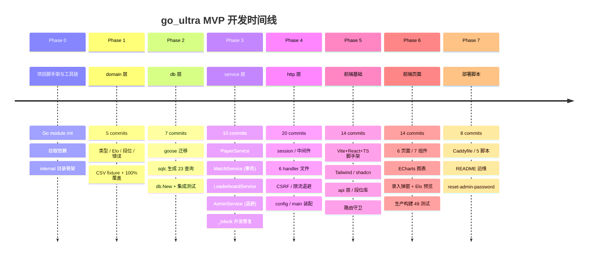
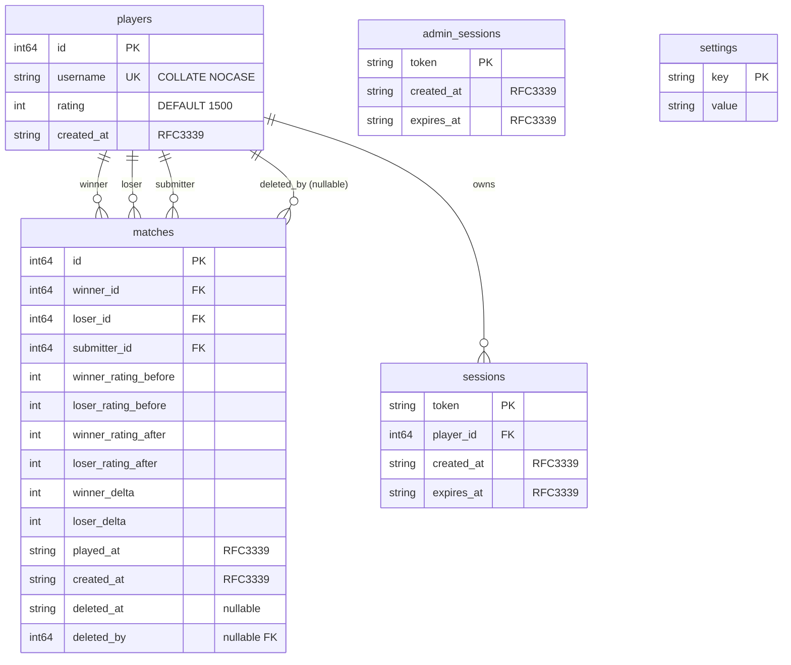
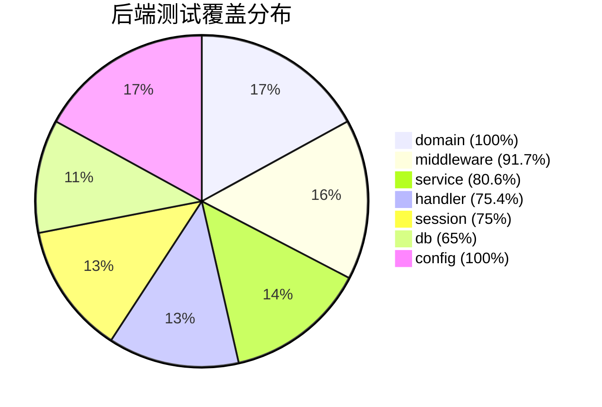
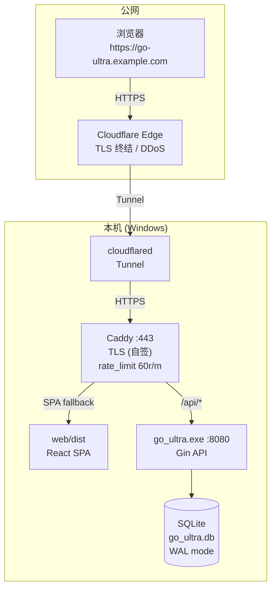

# go_ultra Git 仓库文档

> 仓库地址：本地 `E:\go_ultra`
> 主分支：`main` | 开发分支：`feat/mvp-implementation`
> 总提交：85 | 总文件：157 | 创建日期：2026-06-25

---

## 分支模型



> 当前 `feat/mvp-implementation` 尚未合入 `main`。`main` 仅含设计文档 (spec / plan / contract)。

---

## 提交统计

| 类型 | 数量 | 说明 |
|------|------|------|
| `feat` | 59 | 功能实现 (按阶段 scope: domain/db/service/handler/web/deploy) |
| `chore` | 8 | 工具链/脚手架 |
| `test` | 5 | 纯测试补充 |
| `docs` | 4 | 文档 |
| `harden` | 3 | 安全加固 (ctx-key guard / CSRF wiring test / DSN lock) |
| `fix` | 3 | Bug 修复 (_txlock / type mismatch / gitignore) |
| `refactor` | 2 | 重构 (CAST 整数 / dead code) |
| `style` | 1 | gofmt |

### 按阶段分布

```
Phase 0  ████ 4
Phase 1  ████ 5
Phase 2  ██████ 7
Phase 3  ████████ 10
Phase 4  ████████████████████ 20
Phase 5  ██████████████ 14
Phase 6  ██████████████ 14
Phase 7  ████████ 8
```

---

## 文件结构

```
go_ultra/                        (仓库根, 157 文件)
│
├── .gitignore                   (Go/SQLite/logs/前端产物/IDE/secrets)
├── README.md
├── Caddyfile                    (Phase 7: 反代 + 限速 + SPA fallback)
├── start.bat                    (Phase 7: 启动脚本)
├── stop.bat                     (Phase 7: 停止脚本)
├── scripts/
│   ├── dev.bat                  (Phase 7: 开发模式)
│   └── build.bat                (Phase 7: 生产构建)
│
├── server/                      (后端根, 61 .go + 13 .sql + 2 .csv)
│   ├── go.mod
│   ├── go.sum
│   ├── sqlc.yaml                (sqlc 代码生成配置)
│   │
│   ├── cmd/go_ultra/
│   │   ├── main.go              (入口 + 子命令分发)
│   │   └── main_test.go         (冒烟测试 + dispatch 测试)
│   │
│   ├── queries/                 (sqlc 输入: 原始 SQL)
│   │   ├── players.sql
│   │   ├── matches.sql
│   │   ├── sessions.sql
│   │   └── settings.sql
│   │
│   └── internal/
│       ├── config/
│       │   ├── config.go        (DB路径/监听地址/Origin白名单)
│       │   └── config_test.go
│       │
│       ├── domain/              (纯业务模型, 100% 覆盖)
│       │   ├── types.go         (Player / Stats / Match)
│       │   ├── elo.go           (ExpectedScore / ComputeDelta)
│       │   ├── rank.go          (Dan / RankFloor)
│       │   ├── errors.go        (*Error / WithCause / 哨兵)
│       │   └── testdata/
│       │       ├── rank_cases.csv  (段位共享 fixture, LF-pinned)
│       │       └── .gitattributes  (eol=lf)
│       │
│       ├── db/                  (数据库层)
│       │   ├── db.go            (New: 连接 + PRAGMA + 迁移)
│       │   ├── db_test.go       (集成测试)
│       │   ├── migrations/
│       │   │   └── 00001_init.sql  (goose: 5表 + CHECK + 索引)
│       │   └── sqlc/            (sqlc 生成, 7 文件)
│       │       ├── db.go         (Queries 结构体 + New/WithTx)
│       │       ├── models.go     (表结构体)
│       │       ├── querier.go    (Querier 接口, 23 方法)
│       │       └── {players,matches,sessions,settings}.sql.go
│       │
│       ├── service/             (业务逻辑, 80.6% 覆盖)
│       │   ├── convert.go       (时间/类型转换)
│       │   ├── player.go        (PlayerService: 注册/统计/连胜)
│       │   ├── match.go         (MatchService: 事务录入/视图/历史)
│       │   ├── leaderboard.go   (LeaderboardService: 榜/对比)
│       │   ├── admin.go         (AdminService: 密码/会话/软删/退避)
│       │   └── *_test.go        (所有集成测试)
│       │
│       ├── handler/             (HTTP 层, 75.4% 覆盖)
│       │   ├── router.go        (NewRouter: 路由装配)
│       │   ├── response.go      (统一错误响应)
│       │   ├── health.go        (GET /api/healthz)
│       │   ├── auth.go          (登录/登出/me + admin 鉴权)
│       │   ├── player.go        (玩家查询端点)
│       │   ├── match.go         (录入/列表/软删/恢复)
│       │   ├── leaderboard.go   (排行榜 + 对比)
│       │   ├── harness_test.go  (HTTP 测试夹具)
│       │   └── *_test.go        (所有 HTTP 集成测试)
│       │
│       ├── middleware/          (Gin 中间件, 91.7% 覆盖)
│       │   ├── middleware.go    (RequestID / Logger / Recover)
│       │   ├── auth.go          (PlayerAuth / AdminAuth)
│       │   ├── csrf.go          (OriginCheck)
│       │   └── *_test.go
│       │
│       └── session/
│           ├── session.go       (NewToken / TTL常量 / Cookie名)
│           └── session_test.go
│
└── web/                         (前端根, 35 .tsx + 59 .ts + 2 .css)
    ├── package.json             (pnpm 依赖, scripts)
    ├── pnpm-lock.yaml
    ├── tsconfig.json
    ├── vite.config.ts           (别名 + proxy + vitest)
    ├── tailwind.config.ts       (shadcn 暗色主题)
    ├── postcss.config.js
    ├── components.json          (shadcn/ui new-york/zinc)
    ├── index.html
    │
    └── src/
        ├── main.tsx             (入口: QueryClient + Router + Toaster)
        ├── App.tsx              (路由表)
        ├── index.css            (Tailwind + 暗色 CSS 变量)
        │
        ├── api/                 (后端接口, 6 文件)
        │   ├── types.ts         (TS 类型, snake_case)
        │   ├── client.ts        (axios + ApiError + 401拦截)
        │   ├── players.ts       (登录/玩家查询)
        │   ├── matches.ts       (对局/排行榜/对比)
        │   └── admin.ts         (管理员)
        │
        ├── lib/                 (纯函数库, 5 文件)
        │   ├── rank.ts          (段位映射)
        │   ├── elo-preview.ts   (Elo 预览)
        │   ├── utils.ts         (cn)
        │   ├── echarts-theme.ts (图表主题)
        │   └── __fixtures__/
        │       ├── rank_cases.csv  (段位 fixture, LF-pinned)
        │       └── .gitattributes
        │
        ├── hooks/
        │   └── useAuth.ts       (React Query /api/me)
        │
        ├── components/          (20 文件)
        │   ├── ui/              (12 个 shadcn 基础组件)
        │   ├── Layout.tsx       (顶部导航)
        │   ├── AuthGuard.tsx    (登录守卫)
        │   ├── AdminGuard.tsx   (管理员守卫)
        │   ├── PlayerOverview.tsx (页面布局 B)
        │   ├── RatingChart.tsx  (单线 ECharts)
        │   ├── CompareChart.tsx (多线 ECharts)
        │   ├── RankBadge.tsx    (段位徽章)
        │   ├── MatchTable.tsx   (对局表格)
        │   ├── PlayerCombobox.tsx (玩家搜索)
        │   └── SubmitMatchDialog.tsx (录入弹窗)
        │
        ├── pages/               (6 页面)
        │   ├── Login.tsx
        │   ├── Dashboard.tsx
        │   ├── PlayerDetail.tsx
        │   ├── Leaderboard.tsx
        │   ├── Compare.tsx
        │   └── Admin.tsx
        │
        └── test/
            └── setup.ts         (vitest 全局)
```

---

## 版本历史 (简化)



---

## 数据模型



**关键约束：**
- `CHECK (winner_id != loser_id)` — 禁止自对局
- `CHECK (winner_rating_after = winner_rating_before + winner_delta)` — 分数一致性
- `CHECK (loser_rating_after = loser_rating_before + loser_delta)` — 分数一致性
- `CHECK (winner_delta + loser_delta = 0)` — 零和

---

## API 路由表

```
GET    /api/healthz                      → 健康检查 (无鉴权)

POST   /api/login                        → 登录/隐式注册 (无鉴权)
POST   /api/logout                       → 登出
POST   /api/admin/login                  → 管理员登录 (无鉴权)
POST   /api/admin/logout                 → 管理员登出
GET    /api/admin/status                 → 管理员状态 (无鉴权)

────── PlayerAuth ──────────────────────────────────────────
GET    /api/me                           → 当前用户
GET    /api/players                      → 玩家列表
GET    /api/players/:username            → 玩家详情
GET    /api/players/:username/history    → 历史曲线
GET    /api/players/:username/matches    → 对局列表
POST   /api/matches                      → 录入对局
GET    /api/matches                      → 全局对局流
GET    /api/leaderboard                  → 排行榜
GET    /api/compare                      → 多人对比

────── AdminAuth ───────────────────────────────────────────
DELETE /api/matches/:id                  → 软删除
GET    /api/admin/matches/deleted        → 已删除列表
POST   /api/admin/matches/:id/restore    → 恢复
```

---

## 测试覆盖



| 前端 | 覆盖率 |
|------|--------|
| lib/ (rank + elo-preview) | 100% |
| components/ | 92.7% |
| overall | 83.3% |

---

## 部署拓扑



---

## 提交规范 (Conventional Commits)

| 前缀 | 用途 | 示例 |
|------|------|------|
| `feat(scope)` | 新功能 | `feat(domain): add Elo ExpectedScore and ComputeDelta` |
| `fix(scope)` | 缺陷修复 | `fix(service): set _txlock=immediate to serialize concurrent Record` |
| `test(scope)` | 测试补充 | `test(service): add integration test scaffolding` |
| `chore(scope)` | 工具链/配置 | `chore(web): scaffold vite react-ts project` |
| `refactor(scope)` | 重构 | `refactor(db): CAST CountPlayerWinsLosses aggregates to INTEGER` |
| `docs(scope)` | 文档 | `docs(ops): add operations section` |
| `harden(scope)` | 安全加固 | `harden(http): test CSRF router wiring` |
| `style(scope)` | gofmt | `style(domain): gofmt rank.go doc comment` |

**Scope**: `domain` / `db` / `service` / `middleware` / `handler` / `session` / `config` / `cmd` / `web` / `deploy` / `ops` / `http`

---

## .gitignore 策略

```
/                   logs/       *.db *.db-wal *.db-shm
server/             go_ultra.exe  *.test *.out
web/                node_modules/  dist/
全局                .env .env.*  .superpowers/  .idea/ .vscode/  *.log
```

---

## 环境变量

| 变量 | 用途 | 默认值 |
|------|------|--------|
| `GO_ULTRA_DB` | SQLite 文件路径 | `./go_ultra.db` |
| `GO_ULTRA_ALLOWED_ORIGINS` | CSRF Origin 白名单 (逗号分隔) | `http://localhost:5173` |

---

> **更多信息**: `docs/superpowers/specs/2026-06-25-go-ultra-design.md` (设计规范)
> `docs/superpowers/plans/_contract.md` (接口契约)
> `docs/architecture-overview.md` (技术栈详解)
