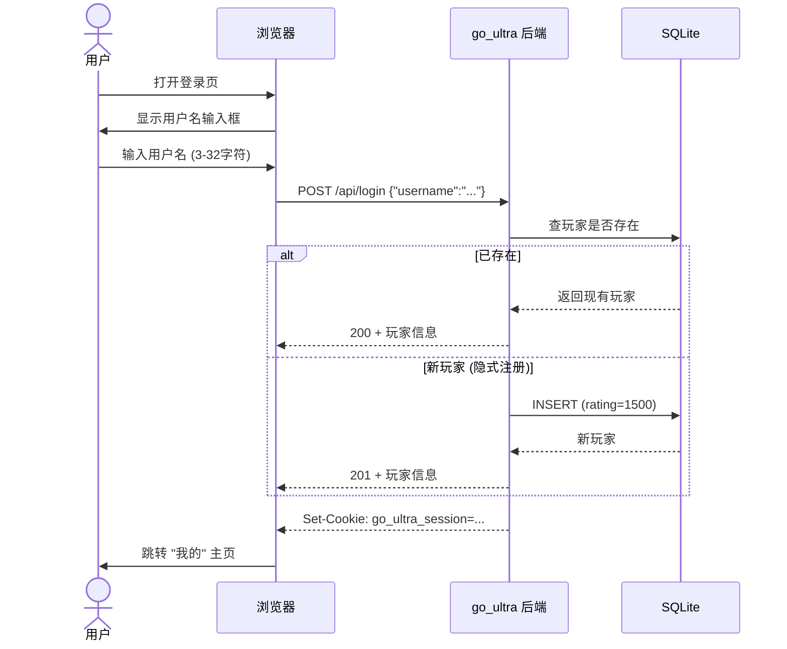

# go_ultra 使用指南

> 从零到上线：安装 → 开发 → 部署 → 运维的完整操作手册。

---

## 目录

1. [环境要求](#1-环境要求)
2. [首次安装](#2-首次安装)
3. [开发模式](#3-开发模式)
4. [生产部署](#4-生产部署)
5. [日常使用](#5-日常使用)
6. [管理后台](#6-管理后台)
7. [运维操作](#7-运维操作)
8. [故障排查](#8-故障排查)
9. [目录速查](#9-目录速查)

---

## 1. 环境要求

| 软件 | 最低版本 | 用途 | 安装方式 |
|------|---------|------|---------|
| **Go** | 1.22+ | 后端编译 / sqlc & goose 工具 | `winget install GoLang.Go` |
| **Node.js** | 18+ | 前端运行时 | `winget install OpenJS.NodeJS` |
| **pnpm** | 9+ | 前端包管理 | `corepack enable && corepack prepare pnpm@latest --activate` |
| **sqlc** | 1.27 | SQL → Go 代码生成 | `go install github.com/sqlc-dev/sqlc/cmd/sqlc@v1.27.0` |
| **goose** | 3.22 | 数据库迁移 | `go install github.com/pressly/goose/v3/cmd/goose@v3.22.1` |
| **git** | 2.30+ | 版本管理 | `winget install Git.Git` |

**部署额外需要：**

| 软件 | 用途 | 安装 |
|------|------|------|
| **Caddy** | 反代 + TLS + 速率限制 | [caddyserver.com/download](https://caddyserver.com/download) (加 `caddy-ratelimit` 插件) |
| **cloudflared** | 内网穿透 | [GitHub Releases](https://github.com/cloudflare/cloudflared/releases) |
| **curl** | 健康探测 | Windows 10/11 自带 |

> 所有 `go install` 安装的工具会落在 `%USERPROFILE%\go\bin`，确保该目录在 `PATH` 中。

---

## 2. 首次安装

### 2.1 克隆仓库

```bat
git clone <your-repo-url> go_ultra
cd go_ultra
```

### 2.2 安装后端依赖

```bat
cd server
go mod download
cd ..
```

### 2.3 安装前端依赖

```bat
cd web
pnpm install
cd ..
```

> 首次 `pnpm install` 需要 1-2 分钟，生成 `pnpm-lock.yaml` + `node_modules/`。

### 2.4 验证安装

```bat
rem 后端编译验证
cd server
go build ./...
go test ./...
cd ..

rem 前端编译验证
cd web
pnpm exec tsc -b
pnpm test
cd ..
```

预期：所有命令无报错，后端 8 包测试通过，前端 8 测试文件通过。

---

## 3. 开发模式

### 3.1 一键启动 (前后端并行)

```bat
scripts\dev.bat
```

会弹出两个命令行窗口：

| 窗口标题 | 内容 | 端口 |
|----------|------|------|
| `go_ultra-dev-api` | 后端 `go run` (实时重编译) | `:8080` |
| `go_ultra-dev-web` | 前端 `pnpm dev` (Vite 热更新) | `:5173` |

### 3.2 分开启动

```bat
rem 终端 1: 后端
cd server
go run ./cmd/go_ultra

rem 终端 2: 前端
cd web
pnpm dev
```

### 3.3 开发流程

```
1. scripts\dev.bat → 打开浏览器 http://localhost:5173
2. 修改前端代码 → Vite 热更新 (浏览器自动刷新)
3. 修改后端代码 → Ctrl+C 后端窗口 → 重新 go run (或等 go run 自动重编译)
4. 运行测试:
   - 后端: cd server && go test ./...
   - 前端: cd web && pnpm test
   - 前端单文件: cd web && pnpm test src/lib/rank.test.ts
```

### 3.4 首次启动 (获取管理员密码)

后端首次启动时，数据库为空，系统会自动生成一个 **16 位随机管理员密码**：

```
===========================================
go_ultra admin password (first start only):
fFQ2CzALXFVQcHHr
===========================================
```

同时写入 `server/logs/admin_password.txt`（在 `server/` 目录下，因 `go run` 的工作目录是 `server/`）。

> ⚠️ **这个密码只出现一次**——请立即复制保存。忘记后需要重置（见 [7.4 重置管理员密码](#74-重置管理员密码)）。

### 3.5 代码生成 (修改数据库后)

```bat
cd server
sqlc generate        rem SQL 查询 → Go 代码
go test ./...        rem 验证生成结果
```

---

## 4. 生产部署

### 4.1 构建

```bat
scripts\build.bat
```

产出物：
| 文件 | 路径 |
|------|------|
| 前端静态文件 | `web\dist\` |
| 后端可执行文件 | `server\go_ultra.exe` |

### 4.2 Cloudflare Tunnel 配置 (一次性)

1. 登录 [Cloudflare Zero Trust](https://one.dash.cloudflare.com/) → **Networks → Tunnels**
2. **Create a tunnel** → 类型 `Cloudflared` → 名称 `go-ultra` → **Save**
3. 选择 **Windows** → 复制命令（含 token）：
   ```
   cloudflared.exe service install eyJhIjoi...(token)...
   ```
4. 在 **Public Hostname** 标签添加：
   - Subdomain: `go-ultra`（用你自己的子域名）
   - Type: `HTTPS`
   - URL: `localhost:443`
   - **Additional settings → TLS → No TLS Verify: ON**
5. 以**管理员身份**运行复制的命令安装 Windows 服务：
   ```bat
   cloudflared.exe service install eyJhIjoi...(你的 token)...
   ```
   输出: `Successfully installed cloudflared!`

### 4.3 启动服务

```bat
start.bat
```

启动流程（自动化）：
```
[start] preparing logs directory ...
[start] launching go_ultra.exe (api :8080) ...
[start] waiting for backend health at http://localhost:8080/api/healthz ...
[start] not ready yet (attempt 1, http=000), retrying ...
[start] backend healthy (attempt 2).
[start] launching caddy ...
[start] launching cloudflared tunnel (go-ultra) ...
[start] all services started.
```

> 后端起好后 **healthz 探活最多等 30 秒**，然后 Caddy 和 cloudflared 依次启动。

### 4.4 验证部署

```bat
rem 本地 API 可用
curl http://localhost:8080/api/healthz
→ {"status":"ok"}

rem 本地 HTTPS (Caddy 自签)
curl -k https://localhost/api/healthz
→ {"status":"ok"}

rem 公网 (Cloudflare Tunnel)
浏览器打开 https://你的域名/
→ 看到 go_ultra 登录页
```

### 4.5 停止服务

```bat
stop.bat
```

输出：
```
[stop] stopping go_ultra.exe ...
[stop]   go_ultra.exe stopped.
[stop] stopping caddy.exe ...
[stop]   caddy.exe stopped.
[stop] stopping cloudflared.exe ...
[stop]   cloudflared.exe stopped.
[stop] done.
```

---

## 5. 日常使用

### 5.1 登录 / 注册



> **没有密码** —— 仅需用户名。系统依赖 session cookie 鉴权，cookie 有效期 30 天。

### 5.2 我的主页

登录后即进入 **"我的"主页** (`/me`)，显示：

```
┌─────────────────────────────────────────┬─────────────┐
│  alice  [段 3]                          │ 统计        │
│  ┌─────────────────────────────────────┐│ 当前等级分 1508 │
│  │         ★ ★ ★ ★ ★ ★ ★ ★ ★ ★         ││ 胜  5       │
│  │      ★ ★ ★ ★ ★ ★ ★ ★ ★ ★ ★ ★       ││ 负  1       │
│  │     ★ ★ ★ ★ ★ ★ ★ ★ ★ ★ ★ ★ ★     ││ 胜率 83.3%  │
│  │    ★ ★ ★ ★ ★ ★ ★ ★ ★ ★ ★ ★ ★ ★    ││ 当前连胜 3  │
│  │   ★ ★ ★ ★ ★ ★ ★ ★ ★ ★ ★ ★ ★ ★ ★  ││ 最长连胜 3  │
│  │  ──段1── ──段2── ──段3── ──段4──    ││             │
│  │  1500 ─────────────────────── 1508 ││ [录入对局]  │
│  │  ─────────────────────────────────  ││             │
│  │  06/25  06/26                       │├─────────────┤
│  └─────────────────────────────────────┘│ 最近对局    │
│                                        │ bob  win    │
│  📊 对比                                │ carol win   │
│                                        │ dave  loss  │
└─────────────────────────────────────────┴─────────────┘
```

**左侧大图**：你的等级分变化曲线 (横轴=时间，纵轴=分数)。虚线段位参考线帮你判断涨跌段位。后端自动 prepend 起点 (注册时 = 1500)。

**右侧栏**：六项统计 (等级分 / 胜负 / 胜率 / 当前连胜 / 最长连胜) + 录入按钮 + 最近 20 局列表。

**连胜逻辑**：从最近一局往回数连续胜利的局数 (败局终止)。当前连胜 = 3 意味着最近 3 局全胜。

### 5.3 录入对局

```
点击 [录入对局] → 弹出对话框:

┌──────────────────────────────────┐
│  录入对局                    [×] │
│                                  │
│  对手 (搜索玩家…下拉)            │
│  ┌──────────────────────────┐   │
│  │ bob                      │   │
│  │ alice  [段3] 1500        │   │
│  └──────────────────────────┘   │
│                                  │
│  结果  ○ 我赢了  ○ 对方赢了      │
│                                  │
│  ⚡ Elo 预览                     │
│  ┌──────────────────────────┐   │
│  │ 你  1500 ──(+8)──→ 1508  │   │
│  │ bob 1500 ──(-8)──→ 1492  │   │
│  └──────────────────────────┘   │
│                                  │
│  对局时间  2026-06-26 14:30      │
│            (留空=当前时间)       │
│                                  │
│          [确认录入]              │
└──────────────────────────────────┘
```

| 字段 | 说明 |
|------|------|
| 对手 | 从已有玩家列表搜索+选择 (不可填自己) |
| 结果 | "我赢了" → 你的分数上涨 |
| Elo 预览 | **实时计算**，纯前端公式 (与后端一致)，不依赖网络 |
| 对局时间 | 可选；默认为当前时间；**不可填未来时间** (后端会拒绝) |

**零和保证**：你赚的分 = 对手亏的分。两人分数总和永远不变。

### 5.4 排行榜

```
┌──────────────────────────────────────┐
│  排行榜                              │
│                                      │
│  🥇          🥈          🥉          │
│ ┌────┐    ┌────┐    ┌────┐          │
│ │ #1 │    │ #2 │    │ #3 │          │
│ │alice│   │bob │    │carol│         │
│ │[段3]│   │[段2]│   │[段2]│         │
│ │1508 │   │1492│    │1500│          │
│ │1局  │   │1局 │    │0局 │          │
│ │100% │   │0%  │    │0%  │          │
│ └────┘    └────┘    └────┘          │
│                                      │
│ 名次  玩家   段位     等级分 局数 胜率│
│ ──────────────────────────────────── │
│  4    dave   [段0]    1400   2   0%  │
│  5    eve    [段0]    1049   0   0%  │
│                  ...                  │
└──────────────────────────────────────┘
```

- Top 3 生成领奖台卡片 (金/银/铜边框)
- 排名按**等级分 DESC** 排列，**过滤 `min_games` 后 rank 仍连续**
- 点击任意玩家 → 跳转到该玩家详情页
- 段位徽章颜色根据分数实时计算

### 5.5 多人对比

```
┌────────────┬──────────────────────────────────────┐
│ 选择玩家    │                                      │
│ ┌─────────┐│  ★ ★ ★ ★ ★ ★ ★ ★ ★ ★ ★ ★ ★ ★ ★ ★    │
│ │搜索…     ││ ★ ★ ★ ★ ★ ★ ★ ★ ★ ★ ★ ★ ★ ★ ★ ★    │
│ └─────────┘│ ★ ★ ★ ★ ★ ★ ★ ★ ★ ★ ★ ★ ★ ★ ★ ★   │
│            │─段1─ ──段2─ ──段3─ ──段4─ ──段5─   │
│ alice  [×] │ ★ alice  ★ bob  ★ carol              │
│ bob    [×] │                                      │
│ carol  [×] ├──────────────────────────────────────┤
│            │ alice vs bob     alice vs carol      │
│ (最多10人) │  2  :  1           3  :  0           │
│            │ bob vs carol                         │
│            │  1  :  2                             │
└────────────┴──────────────────────────────────────┘
```

| 功能 | 说明 |
|------|------|
| 添加玩家 | 从已有玩家列表搜索→选择 (重复自动去重) |
| 移除玩家 | 点 `×` 移除 |
| 上限 | **最多 10 人** (与后端限制一致) |
| URL 持久化 | 玩家列表写在 URL `?p=alice,bob` 中，刷新页面可恢复 |
| 曲线 | 每条线一个颜色 (5 色调色板循环)，带起点 (创建时=1500) |
| 头对头 | C(n,2) 组合的胜负统计 (仅计未删除对局) |

**5 色调色板**: `#4a9eff` (蓝) → `#7fd6a3` (绿) → `#8b5cf6` (紫) → `#e0c47d` (金) → `#f08080` (红) → 循环。

---

## 6. 管理后台

### 6.1 登录管理员

```
访问 /admin → 弹出密码框:

┌──────────────────────┐
│   管理员登录          │
│                      │
│   密码               │
│   ┌──────────────┐   │
│   │ ************ │   │
│   └──────────────┘   │
│                      │
│   [      登录      ]  │
│                      │
└──────────────────────┘
```

| 情形 | 返回 |
|------|------|
| 密码正确 | toast "管理员已登录"，进入面板 |
| 密码错误 | toast "密码错误"，**触发退避** |
| 频繁输错 | toast "尝试过于频繁，请稍后" + **HTTP 429** |

### 6.2 指数退避机制

```
失败次数    锁定时间
───────────────────────
  1 次  →   2 秒
  2 次  →   4 秒
  3 次  →   8 秒
  4 次  →  16 秒
  5 次  →  32 秒
     ...
 12+ 次 → 3600 秒 (1 小时封顶)
```

- 锁定期间所有管理员登录请求 (无论密码) 都返回 `429 RATE_LIMITED`
- 登录成功 → **立即清空退避计数器**
- 进程重启 → 计数器清零 (内存态)

### 6.3 管理操作

```
管理员面板:

┌──────────────────────────────────────────┐
│  管理员面板                              │
│                                          │
│  已删除对局                              │
│  ┌──────────────────────────────────────┐│
│  │ ID  赢家   输家   时间      操作     ││
│  │──────────────────────────────────────││
│  │  3  alice  bob   06/25 14:30 [恢复] ││
│  │  7  dave   carol 06/24 09:00 [恢复] ││
│  └──────────────────────────────────────┘│
└──────────────────────────────────────────┘
```

| 操作 | 说明 |
|------|------|
| 删除对局 | 只有**管理员**可删；普通用户菜单无此选项 |
| 软删除 | 对局标记 `deleted_at`，不清除数据 |
| 效果 | 删除后**立即**从排行榜/历史/对局列表**消失**，等级分**不回溯** |
| 恢复 | 撤销软删除，记录重新出现在排行榜/历史中 |
| 幂等 | 重复恢复/删除不报错 |

---

## 7. 运维操作

### 7.1 查看日志

```bat
rem Caddy 日志 (JSON 格式，10MB 滚动保留7份)
type E:\go_ultra\logs\caddy.log

rem 后端日志 (stdout，用 start.bat 拉起时不可见；开发模式在命令行窗口可见)
```

### 7.2 手动备份

```bat
rem 1. 先停止服务
stop.bat

rem 2. 复制数据库
mkdir E:\go_ultra\backups
copy "E:\go_ultra\server\go_ultra.db" "E:\go_ultra\backups\go_ultra-20260626.db"

rem 3. 重启
start.bat
```

| 注意 | 说明 |
|------|------|
| WAL 伴随文件 | 运行中还有 `.db-wal` + `.db-shm`——**停止后会自动合并**，只需备份 `.db` |
| 备份频率 | 建议每周手动备份；MVP 无自动备份 |
| 恢复 | `stop.bat` → 覆盖 `server\go_ultra.db` → `start.bat` |

### 7.3 查看管理员密码 (首启时)

```bat
rem 首启后密码明文写在此文件
type E:\go_ultra\server\logs\admin_password.txt
```

> ⚠️ 此文件含明文密码，建议**记下密码后立即删除**。若需保留，收紧权限：
> ```bat
> icacls logs\admin_password.txt /inheritance:r /grant:r "%USERNAME%:R"
> ```

### 7.4 重置管理员密码

如果忘记密码或需要轮换：

```bat
rem 1. 停止后端
stop.bat

rem 2. 运行重置命令
cd server
go_ultra.exe reset-admin-password

rem 输出:
rem ===================================================
rem ADMIN PASSWORD (reset, shown only once):
rem N3p8Zq1Wd6Yb4Hs
rem also written to logs/admin_password.txt
rem ===================================================

rem 3. 记下密码 + 重启
cd ..
start.bat
```

> 旧密码**立即失效**。新密码写入 `settings` 表覆盖旧的 bcrypt 哈希。

### 7.5 手动管理 cloudflared 服务

```bat
sc query cloudflared          rem 查看状态
sc stop  cloudflared          rem 停止
sc start cloudflared          rem 启动
cloudflared service uninstall rem 卸载服务
```

### 7.6 更新 Caddyfile 配置后

```bat
rem 验证语法
caddy validate --config Caddyfile
→ Valid configuration

rem 重载 (不停服务)
caddy reload --config Caddyfile
```

### 7.7 迁移数据库

```bat
cd server

rem 查看当前迁移版本
goose -dir internal/db/migrations sqlite3 ./go_ultra.db status

rem 向前迁移
goose -dir internal/db/migrations sqlite3 ./go_ultra.db up

rem 回滚一步
goose -dir internal/db/migrations sqlite3 ./go_ultra.db down
```

---

## 8. 故障排查

### 8.1 后端启动失败

| 症状 | 可能原因 | 解决 |
|------|---------|------|
| `go run` 报 `missing go.sum entry` | 依赖未下载 | `cd server && go mod tidy` |
| `go run` 报 `no required module provides` | go.mod 版本问题 | 检查 `go 1.22` 指令 |
| 启动后 healthz 返回 000 | 端口占用/崩溃 | 查 `:8080` 是否被占用: `netstat -ano \| findstr 8080` |
| `panic: database is locked` | 多实例/并发写冲突 | 确认只有一个后端进程 |

### 8.2 前端编译失败

| 症状 | 可能原因 | 解决 |
|------|---------|------|
| `tsc -b` 报类型错误 | 依赖版本不匹配 | `pnpm install` 重新装 |
| `pnpm dev` 报 `Cannot find module` | node_modules 不完整 | `rm -rf node_modules && pnpm install` |
| `vite` 版本警告 | Vite 8 不兼容某些插件 | 确认 `vitest@^4` + `@vitejs/plugin-react@^6` |

### 8.3 登录 / 鉴权问题

| 症状 | 可能原因 | 解决 |
|------|---------|------|
| 登录后立即跳回 /login | Cookie 被浏览器拒绝 | 检查浏览器是否拦截第三方 Cookie |
| Chrome "未设置为安全" | Secure cookie 需 HTTPS | 开发模式 localhost 是安全上下文，不需 HTTPS |
| `GET /api/me` 返回 401 | Session 过期 (30天) | 重新登录 |

### 8.4 录入对局失败

| 症状 | 可能原因 | 解决 |
|------|---------|------|
| 400 `SELF_MATCH` | 对手选了自己 | 换一个正确对手 |
| 400 `INVALID_PARAM` | 对局时间填了未来时间 | 改回过去或留空 |
| 400 `INVALID_PARAM` | 缺少 Origin 头 | 正常浏览器请求自带，非浏览器客户端需手动加 |
| 404 `PLAYER_NOT_FOUND` | 对手名不存在 | 用 combobox 搜索选，不要手输不存在的名 |

### 8.5 管理员登录失败

| 症状 | 可能原因 | 解决 |
|------|---------|------|
| 429 `RATE_LIMITED` | 触发退避锁定 | 等待锁定窗口结束或重启后端 |
| 一直"密码错误" | 忘记密码 | `reset-admin-password` 重置 |
| 管理员 cookie 丢失 | 30 分钟过期 | 重新登录 |

### 8.6 Caddy 无法启动

| 症状 | 可能原因 | 解决 |
|------|---------|------|
| `unrecognized directive: rate_limit` | 用的官方 Caddy (无插件) | 用 `xcaddy` 重建含 `caddy-ratelimit` 的版本 |
| `permission denied` | 端口 443 需管理员权限 | 以管理员运行 Caddy |
| `listen tcp :443: bind` | 443 被占用 | `netstat -ano \| findstr 443` 查占用 |

### 8.7 cloudflared 连接失败

| 症状 | 可能原因 | 解决 |
|------|---------|------|
| `ERR Failed to connect` | 隧道未创建/未授权 | 在 Zero Trust 确认 Tunnel 状态为 Healthy |
| `ERR unable to reach the origin` | Caddy 未启动 | 确保 `start.bat` 完整执行 |
| TLS 错误 | No TLS Verify 未开启 | 在 Tunnel Public Hostname 设置中开启 |

---

## 9. 目录速查

| 路径 | 内容 | 用途 |
|------|------|------|
| `server/` | Go 后端根目录 | |
| `server/cmd/go_ultra/` | 入口 main.go | 启动 + 子命令 |
| `server/internal/config/` | 配置加载 | DB路径 / 监听 / Origin |
| `server/internal/domain/` | 领域模型 | Elo / 段位 / 错误类型 |
| `server/internal/db/` | 数据库层 | 连接 / 迁移 / sqlc 生成 |
| `server/internal/service/` | 业务逻辑 | 玩家 / 对局 / 排行榜 / 管理员 |
| `server/internal/handler/` | HTTP 层 | 路由 / handler / 错误响应 |
| `server/internal/middleware/` | 中间件 | 鉴权 / CSRF / 日志 / Recover |
| `server/queries/` | 原始 SQL | sqlc 输入 |
| `web/` | 前端根目录 | |
| `web/src/api/` | API 调用层 | axios 封装 |
| `web/src/lib/` | 纯函数库 | Elo / 段位 / 图表主题 |
| `web/src/components/` | 组件 | 图表 / 表格 / 守卫 / 弹窗 |
| `web/src/pages/` | 页面 | 登录 / 主页 / 排行榜 / 对比 / 管理 |
| `web/src/hooks/` | Hook | useAuth |
| `Caddyfile` | Caddy 配置 | 反代 + TLS + 限速 |
| `start.bat` | 启动脚本 | 后端→healthz→Caddy→Tunnel |
| `stop.bat` | 停止脚本 | taskkill 三个进程 |
| `scripts/dev.bat` | 开发脚本 | 并行前后端 |
| `scripts/build.bat` | 构建脚本 | 前端 dist + 后端 .exe |
| `logs/` | 日志/密码 | caddy.log / admin_password.txt |
| `server/go_ultra.db` | 主数据库 | SQLite (默认路径) |
| `server/_tmp_migrate_check.db` | 迁移验证临时库 | 可安全删除 |
